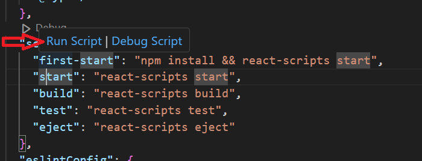
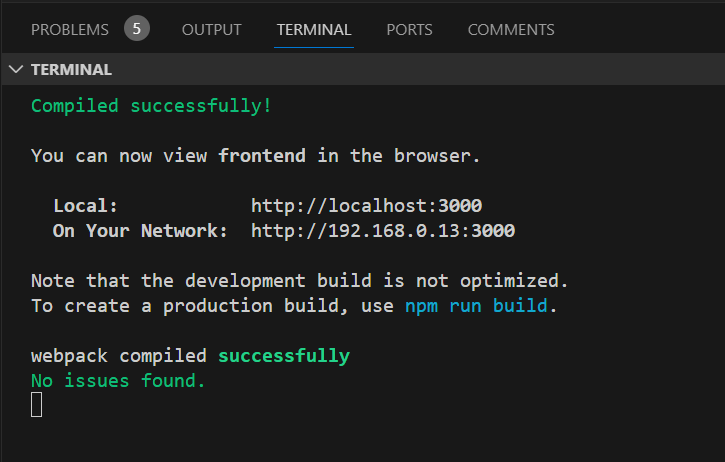
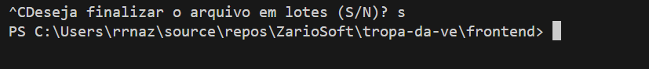

# Tropa da Ve - Frontend

## Para rodar a primeira vez

- Acesse o arquivo [package.json](package.json), pause o mouse sobre o comando `first-start` e depois clique em `Run Script`, conforme a imagem:

- Uma vez feito, o Visual Studio Code abrirá uma janela de terminal na parte de baixo, indicando sucesso. Ao mesmo tempo, a janela do browser mostrará a aplicação rodando:

- Vale lembrar que basta executar uma única vez e a aplicação ficará rodando até que você execute o comando CONTROL + C na tela do terminal:

## Para rodar nas vezes subsequentes

- Faça o passo da seção anterior, mas rodando dessa vez o comando `start`.